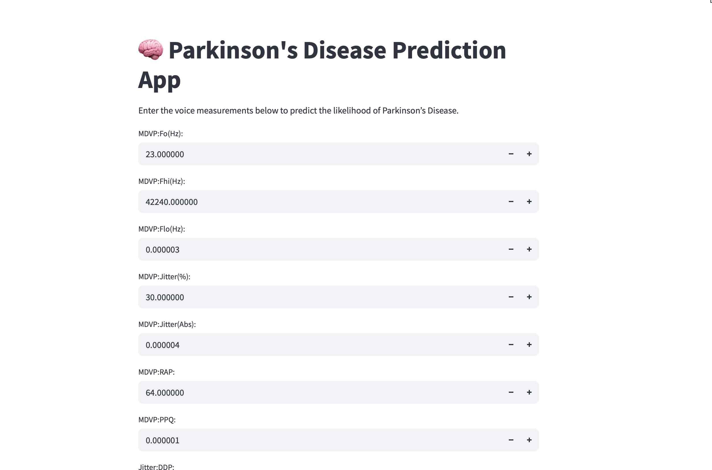
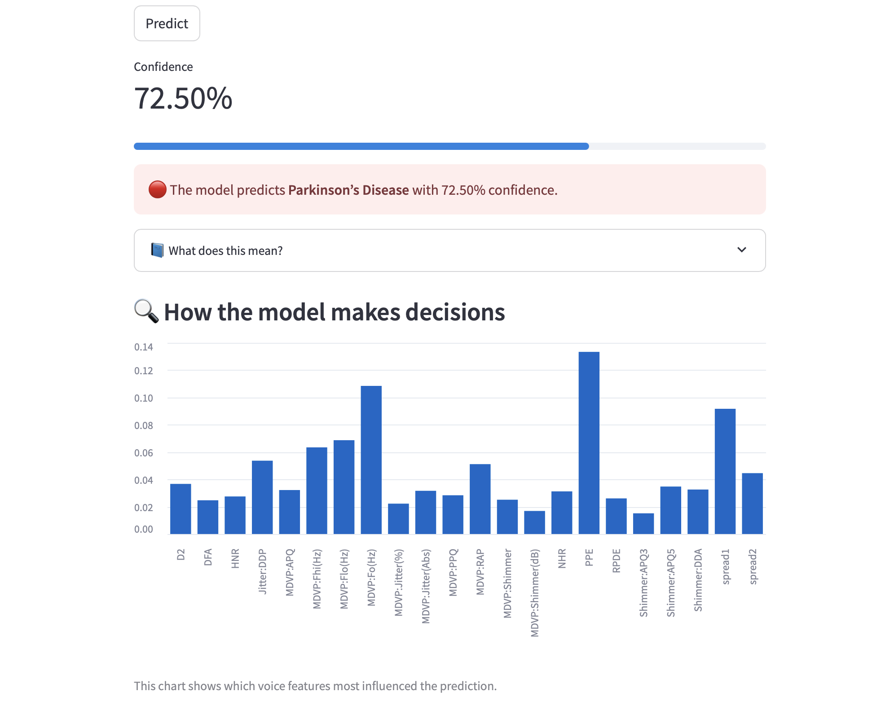

# 🧠 Parkinson's Disease Prediction using Machine Learning

This project focuses on predicting the likelihood of Parkinson’s Disease based on vocal measurements using a trained machine learning model. The app is deployed using **Streamlit** and provides real-time predictions, feature importance insights, and user-friendly explanations.

---

## 🔍 Project Overview
Parkinson’s Disease is a progressive neurological disorder that affects movement and speech. Early diagnosis plays a crucial role in improving patient outcomes. This project leverages classical machine learning on biomedical voice measurements to classify individuals as healthy or potentially affected.

### 💡 Key Idea:
Use a Random Forest Classifier with hyperparameter tuning to build an interpretable, accurate model. Deploy it via Streamlit to make predictions interactive and accessible.

---

## 📁 Project Structure
```
parkinsons-prediction-app/
├── app.py                      # Streamlit web app
├── parkinsons_model.pkl        # Trained ML model
├── scaler.pkl                  # StandardScaler for preprocessing
├── requirements.txt            # Python dependencies
├── README.md                   # Project documentation
```

---

## 📊 Dataset Description
**Source**: UCI Parkinson’s Disease Dataset  
**Target Variable**: `status` (1 = Parkinson's, 0 = Healthy)  
**Total Records**: 195  

**Features**:
- MDVP:Fo(Hz), MDVP:Fhi(Hz), MDVP:Flo(Hz), MDVP:Jitter(%), MDVP:Jitter(Abs)
- MDVP:RAP, MDVP:PPQ, Jitter:DDP, MDVP:Shimmer, MDVP:Shimmer(dB)
- Shimmer:APQ3, Shimmer:APQ5, MDVP:APQ, Shimmer:DDA
- NHR, HNR, RPDE, DFA, spread1, spread2, D2, PPE

---

## 🎯 Goals
- Load and preprocess structured voice data
- Train and evaluate a Random Forest classifier
- Tune hyperparameters using GridSearchCV
- Save and deploy the model with Streamlit
- Enable real-time user input, prediction, and explanation

---

## ⚙️ Setup Instructions
### 1. Clone the repository
```bash
git clone https://github.com/your-username/parkinsons-prediction-app.git
cd parkinsons-prediction-app
```

### 2. Create and activate a virtual environment
```bash
python3 -m venv tfenv
source tfenv/bin/activate
```

### 3. Install dependencies
```bash
pip install -r requirements.txt
```

### 4. Run the web app
```bash
streamlit run app.py
```

---

## 🧠 Model Used
| Model              | Description                  |
|-------------------|------------------------------|
| Random Forest      | Ensemble of decision trees   |

**Evaluation Metrics**:
- ✅ Accuracy
- ✅ Precision
- ✅ Recall
- ✅ F1-Score

---

## 📈 Visual Features
- Live probability confidence bar
- Feature importance chart
- Patient-friendly result explanation




---

## 📝 Output & Model Saving
Final model saved as:
- `parkinsons_model.pkl`
- `scaler.pkl`

---

## 🚀 Future Enhancements
- ✅ Add downloadable patient reports (PDF)
- ✅ Add radar chart for patient comparison
- 🔍 Add SHAP explanations for interpretability
- 🌐 Deploy to HuggingFace Spaces or Render

---

## 🙌 Acknowledgments
- UCI Parkinson’s Dataset
- scikit-learn documentation
- Streamlit team
- Inspired by real-world medical ML applications
